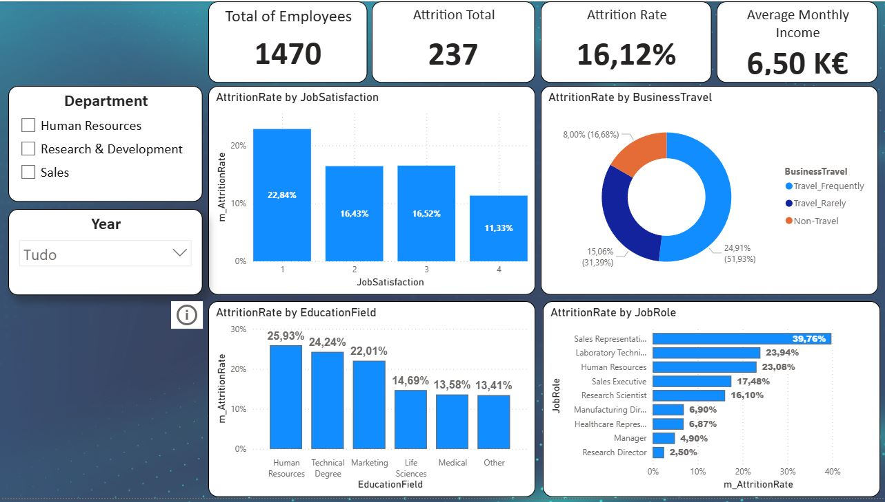

# hr-attrition-analysis
Analysis of employee attrition using Power BI and SQL to identify key drivers and support retention decisions.

## Project Overview
This project analyzes employee attrition to identify key drivers and support data-driven retention decisions.  
The analysis focuses on workforce demographics, job characteristics, and trends over time.

The project was built using **Power BI** for visualization and **SQL** for data analysis and preparation.

---

## Business Questions
- Which departments have the highest attrition rates?
- Are job satisfaction and overtime associated with attrition?
- Which job roles should be prioritized for retention actions?
- How has attrition evolved over time?

---

## Tools & Technologies
- **Power BI** (DAX, drillthrough, bookmarks, data modeling)
- **SQL** (joins, aggregations, filtering)
- **Power Query / Excel** (data cleaning and transformation)

---

## Key Insights
- Sales shows the highest attrition rate compared to other departments.
- Attrition is higher among employees with lower job satisfaction.
- Employees working overtime present a higher attrition risk.
- Certain job roles concentrate a disproportionate share of attrition.

---

## Dashboard Structure
- **Overview page:** High-level KPIs and main attrition drivers
- **Drillthrough page:** Department-level deep dive (age, gender, overtime, trends)

---

## Screenshots

### Dashboard Overview

This dashboard shows the overall employee attrition in the company.  
It includes the total number of employees, how many left the company, the attrition rate, and breakdowns by job satisfaction, job role, education field, and business travel.

---

### Key Attrition Insights

This view summarizes the main insights from the analysis:
- Employees with low job satisfaction have higher attrition rates
- Some job roles show significantly higher attrition than others
- Business travel and overtime appear to influence employee turnover

---

### Department Drillthrough

This page allows deeper analysis by department.  
By selecting a department, it is possible to analyze attrition trends by year, age group, gender, and overtime status.

---

### Data Model (Star Schema)

This image shows the data model used in Power BI.  
The project follows a star schema design with one fact table and multiple dimension tables, making the data easier to analyze and maintain.

## What I Learned

Through this project, I improved my skills in SQL analysis, data modeling, and Power BI dashboard design.  
I learned how to identify key drivers of employee attrition and how to communicate insights using clear and interactive visuals.
